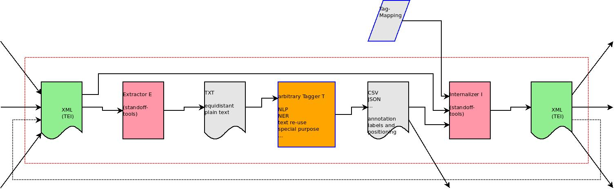

[](http://www.gnu.org/licenses/gpl-3.0.txt)
[](https://app.travis-ci.com/lueck/standoff-tools)

# standoff-tools - tools for handling standoff annotations #

`standoff-tools` offers a command line program for handling standoff
annotations, i.e. annotations that occur away from the document they
annotate. In particular, it offers a command to **internalize**
standoff markup into the source document in such a way, that the
produced XML is syntactically correct, even when the annotations
overlap each other and overlap the internal markup of the source
document. This is done by splitting the external markup; the internal
markup is never split.

[The terms *standoff annotations*, *source document*, *internal
markup*, *internalize*, etc. that are used here were [defined by the
TEI
community](https://www.tei-c.org/release/doc/tei-p5-doc/en/html/SA.html#SASO). We
add the term *split* (noun), which means a portion of an annotated
text run. *Splitting* is the action of dividing an annotated text run
in order to make non-overlapping markup. There's also the term *text
range* which is widely used in the source code: It means the annotated
text run.]

In addition, `standoff-tools` can also generate a certain flavour of
plain text from XML, where the text nodes have the same character
offset from the file's beginning as in the XML file, but tags are
stripped/replaced by filling characters. This is called equidistant
plain text. The two programs enable us to use existing tools for text
analysis that were written for plain text, and to feed back their
results into the XML document using the internalizer. We can re-use
these tools in automatic annotation pipelines for XML, e.g. TEI-XML
documents. (See `dev` branch!)




## Features ##

- command for internalizing standoff annotations into the source document
- standoff annotations may reference the source document using
  *character offsets* or *pairs of line and column numbers* (see
  road-map for other referencing mechanisms)
  - parse standoff annotations produced with
    [`standoff-mode`](https://github.com/lueck/standoff-mode)
  - parse annotations given in CSV using the above mentioned
    referencing methods and providing arbitrary other features. The
    CSV header is used to make key-value pairs.
- mappings of annotation features (key-value pairs) to XML attributes
  defined in YAML
  - Special features of each split can be used to provide the
    internalized splits with a unique ID and with a pointer to the
    previous split, e.g. for TEI's `@prev`.
- define a constant element name for internalized splits or use a
  annotation feature to determine the element name
- commands for inspecting the annotations
- commands for inspecting the source document


## History ##

`standoff-tools` was first developed in 2015 in order to internalize
assertive standoff annotations on TEI documents, which were produced
with [`standoff-mode`](https://github.com/lueck/standoff-mode), a
tagger for [GNU Emacs](https://www.gnu.org/software/emacs/). This tool
works with annotation schemes defined in RDFS/OWL, lets you make
discontinuous markup, relations of text runs, and free text
comments. `standoff-tools` enabled us to
[visualize](https://github.com/lueck/standoff-viz) our annotations in
a browser.

The target in 2021 is to use `standoff-tools` in various annotation
pipelines, either with human or machine-driven annotators, where
annotations have to be internalized into the TEI source document.


## Road-map ##

- Add a feature-dependent tag internalizer.
- Make it a webservice.
- Add an option to drop splits of external markup that run over
  whitespace only. That would considerably reduce the amount of
  schematically invalid internalized splits that fall between
  `<div>`s and other block elements.
- Add parsers for other referencing methods, e.g. XPath and XPointer
  expressions or Web Annotations with offset selectors.
- Implement a full blown validating internalizer.
- Re-implement the XML-Parser (that was the first thing I've ever
  written in Haskell :-))
- extractor of equidistant plain text (see `dev` branch)
- shrink equidistant plain text and generate a mapping of positions
- updater of annotation references based on patches of the source
  document (very far away)


# Installation #

`standoff-tools` is written in the Haskell programming language. To
compile and run it, [`stack`](https://haskellstack.org), the haskell
build tool, is required. After having installed stack, you have to
clone this repository, `cd` into the working copy and compile the
program in a sandboxed environment:

```{shell}
git clone https://github.com/lueck/standoff-tools.git
cd standoff-tools
stack setup
stack build
```

To install it use:

```{shell}
stack install
```

If you want to try it first, without installation, you can use all the
program's features by executing it through `stack` from the sandbox:

```{shell}
stack exec -- standoff --help
```

To run tests do `stack test :unit-tests`. There is also a testsuite
with real world tests, which require TEI-P5 input files. If you want
to run these tests, too, then don't hesitate to contact me for getting
the files.


## Usage ##

`stack build` generates an executable named `standoff`, which offers
some sub-commands. Run `standoff` with the `--help` option like
follow:

```{shell}
standoff --help
```

You will see `internalized` in the list of available
sub-commands. Each sub-command offers it's own help message:

```{shell}
standoff internalize --help
```

### Attribute Mappings ###

The parser for annotations given in CSV makes key-value pairs from the
header names and the values in each row. The keys are mapped to a
triple of XML prefix, XML name, and XML namespace. There are also
special keys for each text range and split:

- `__standoff_special__splitId`: The value is a concatenation of the
  `id` feature and the split number (but for the first split the `id`
  onyl). This can be used for `xml:id`.
- `__standoff_special__prevId`: A pointer to the `@xml:id` of the
  previous split. It can be used in TEI's `@prev`.
- `__standoff_special__ns`: It has the constant value "unknown" and
  can be used to set the namespace of the inserted element. Note, that
  you can use a prefixed element name!

See [`mappings/som-tei.yaml`](mappings/som-tei.yaml) for an example.


## Implementation ##

If you are interested in the internalizer's implementation, which is
based on position-based splitting instead of a look-ahead parser, have
a look at [`Internalize.hs`](src/StandOff/Internalize.hs).


# License #

[GPL V3](http://www.gnu.org/licenses/gpl-3.0.txt)
