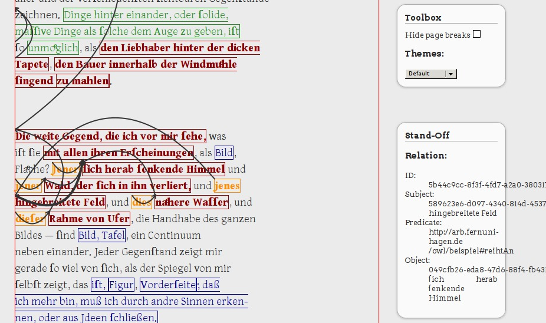

# standoff-tools - tools for handling standoff annotations #

`standoff-tools` offers a command line program for handling standoff
annotations produced with
[`standoff-mode`](https://github.com/lueck/standoff-mode), a tagger for
[GNU Emacs](https://www.gnu.org/software/emacs/). While
`standoff-mode` produces external markup that references text ranges of
the source file by character offsets, `standoff-tools` offers a
command to internalize such stand-off markup into the source file. The
source file must be valid XML file, e.g. TEI P5.

`standoff-tools` is also a library that can be reused for
internalizing any external markup, that references the source with
*character offsets*. Only a parser must be implemented for working
with files (or a binding to a relational database).

# Installation #

`standoff-tools` is written in the Haskell programming language. To
use it, it has to be compiled and linked. Requirements are a the
[`haskell-platform`](https://www.haskell.org/platform/) and the
`cabal` package and dependencies manager, which is already included in
the `haskell-platform`. After having these installed, clone the
repository and build the command line program in a `cabal sandbox`:

	$ git clone https://github.com/lueck/standoff-tools.git
	$ cd standoff-tools
	$ cabal update
	$ cabal sandbox init
	$ cabal install

To run tests `cabal install` has to be run with the `--enable-tests`
option.

	$ cabal install  --enable-tests
	$ cabal test

# Usage #

## Commands ##

`cabal install` generates an executable named `standoff`, which offers
some sub-commands:

<pre><code>
standoff - a tool for handling standoff annotations (aka external markup).

Usage: standoff COMMAND
  standoff offers commands for parsing a dump file that contains external markup
  and for internalizing such external markup into an xml file. There is also a
  command for parsing a file for newlines, which may be useful for debugging.

Available options:
  -h,--help                Show this help text

Available commands:
  dumped                   Reads annotations generated with GNU Emacs'
                           standoff-mode and dumped in FILE. The output can be
                           formatted in raw (default) or in JSON format. The
                           output can be filtered for annotation types. If no
                           filtering option is given, all annotation types are
                           returned in the output.
  internalize              Internalize external annotations given in DUMPFILE
                           into SOURCE. DUMPFILE must be generated (or must look
                           like it's been generated) with GNU Emacs'
                           standoff-mode. SOURCE must be a valid XML file, at
                           least it must contain a root node. There are options
                           on how the internalizer should serialize markup
                           ranges, its type information, IDs etc. By default
                           only markup ranges are internalized, but not
                           relations.
  offsets                  Returns the character offsets, lines and columns of
                           the nodes of an XML file.

See also: https://github.com/lueck/standoff-mode/ - standoff-mode is a tagger
for GNU Emacs.
</code></pre>

Run `standoff COMMAND --help` to get help for each command.

Use `standoff internalize` to internalize external annotations
generated with `standoff-mode` into a source file. These are the
command line options (output of `standoff internalize --help`):

<pre><code>
standoff internalize - internalize standoff markup into an xml file.

Usage: standoff internalize ((-s|--simple) | (-p|--prefix PREFIX) |
                            (-n|--span ELEMENT TYPE-ATTR) | (-t|--tei))
                            [-r|--range-id ARG] [-e|--element-id ARG]
                            [-i|--processing-instruction ARG] DUMPFILE SOURCE
  Internalize external annotations given in DUMPFILE into SOURCE. DUMPFILE must
  be generated (or must look like it's been generated) with GNU Emacs'
  standoff-mode. SOURCE must be a valid XML file, at least it must contain a
  root node. There are options on how the internalizer should serialize markup
  ranges, its type information, IDs etc. By default only markup ranges are
  internalized, but not relations.

Available options:
  -s,--simple              Serialize tags with a very simple serializer that
                           uses the markup type as tag name. This is only
                           usefull for markup types without namespaces.
  -p,--prefix PREFIX       Serialize tags using the markup type as tag name. The
                           name is prefixed with a general PREFIX, the namespace
                           of which is defined on every internalized tag. So,
                           using this tag internalizer every internalized tag
                           starts like this: <PREFIX:localname
                           xmlns:PREFIX='...' ...>. Be careful not to break
                           namespace definitions of the xml tree in source file.
                           Is it valid xml when the namespace, which is
                           connected to a prefix, is changed while a so-prefixed
                           elment is still open?
  -n,--span ELEMENT TYPE-ATTR
                           Serialize tags into elements of name ELEMENT. The
                           markup type is written to the attribute named
                           TYPE-ATTR.
  -t,--tei                 Conveniance for "-n span rendition". This seems to be
                           working good for TEI P5 source files.
  -r,--range-id ARG        Attribute name for markup range IDs. Defaults to
                           "rid".
  -e,--element-id ARG      Attribute name for markup element IDs. Defaults to
                           "eid".
  -i,--processing-instruction ARG
                           Insert a processing instruction into the result.
  -h,--help                Show this help text

Roadmap: A serializer which takes a map of prefixes is about to be implemented.
</code></pre>

## Visualizing annotations and relations in a browser ##

`standoff-tools` comes with some scripts that make it easy to display
annotations and relations between annotated text ranges in a
browser. They are designed for working with TEI P5 as source files and
make use of
[TEI Boilerplate](https://github.com/GrantLS/TEI-Boilerplate) for
rendering in TEI XML in your browser. The following scripts from the
`utils/tei` directory have to copied to the `dist/contents` directory of
your clone of `TEI Boilerplate`:

- `canvas4tei.xsl`: xslt stylesheet that imports (includes) `TEI
  Boilerplate`, but overrides the template responsible for generating
  the `body` element of the resulting html. It inserts a canvas, loads
  [`jQuery`](https://jquery.com/) and javascript for drawing relations
  between annotated text spans.

- `jannotation.js`: javascript library for drawing relations.

- `static.js`: javascript that loads static content from
  `relations.json` (see below) and calls the drawing functions form
  `jannotation.js`.

You should also put `standoff.css` into the `dist/css` directory of
your clone of `TEI Boilerplate`.

To generate internalized markup run `standoff internalize` like this
and copy it's output into the `contents` directory of your boilerplate
clone, too:

	$ standoff internalize --tei -i "<?xml-stylesheet type=\"text/xsl\" href=\"canvas4tei.xsl\"?>" DUMP-FILE SOURCE-FILE > OUTPUT

This not only internalizes the external markup but also inserts a
processing instruction into the resulting XML, so that the canvas will
automagically be inserted into the nive boilerplate representation of
the annotated TEI source.

As a second step you have to generate a JSON file containing the
relations:

	$ standoff dumped -j -l DUMP-FILE > relations.json

The resulting `relations.json` have to be present in the `contents`
directory, too. It has to be that file name, which is hard-coded in
`arrows.js`. If you have a `custom.css` like explained in the docs of
TEI Boilerplate, your annotations get colored and semantic relations
may look like in the screenshot below. When you move your mouse over a
relation, you will see details in the info box on the left:

As you can see in the sample, the drawing of semantic relations
suffers from the html-box-model of inline elements which span multiple
lines. Proposals on how to improve the drawing of relations are
welcome.

Note that the canvas for drawing semantic relations is limited to a
height of 32.000 pixels at the moment.

# Roadmap #

- updater
- database version of the `standoff` executable in order to
  + write parsed node offsets to a relational database
  + write parsed dump file to a relational database
- parse node offsets of tag soup

# License #

[GPL V3](http://www.gnu.org/licenses/gpl-3.0.txt)
