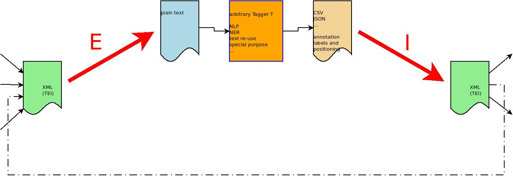

[](http://www.gnu.org/licenses/gpl-3.0.txt)
[test status](https://github.com/lueck/standoff-tools/actions/workflows/test-main.yml/badge.svg?branch=master)

# Stand*off* Tools - tools for handling standoff annotations #

Stand*off* Tools (`standoff-tools`) offer generic services for
building annotation pipelines for enriching XML,
e.g. [TEI-XML](https://www.tei-c.org), using taggers for plain text
analysis. They help to bridge between the land of XML hierarchies and
the land of processing a stream of tokens.



In detail, Stand*Off* offer two services, that are concerted to each other.

- Extractor *E*: extracts plain text from XML

- Internalizer *I*: merges results back into XML so that the result is
  wellformed XML


Slides for the [TEI 2022 conference](https://clueck.zivgitlabpages.uni-muenster.de/tei2022/standoff-tools/slides2.html)


## Requirements for the tagger

To use these services, the tagger for plain text analysis has to
provide records with character offsets. Just a list of strings is not
enough. E.g. imagine a tagger for named entity recognition (NER), that
returns CSV, one row for each found name, with offsets of
the start and end characters of the found names and maybe other
features like persistent identifiers of the named entities.

```{csv}
start,end,string,id
1051,1055,Locke,...
1073,1082,Descartes,...
2033,2037,Locke,...
3451,3455,Wolff,...
...
```

CSV files suitable for Stand*off* Tools must provide at least the two
columns `start` and `end`, or `start` and `length`.

There are many tools and libraries out there, that provide offset
information: Spacy, ANTLR-based grammar parsers, Python's regex
library, (WebLicht), ...

Features in the other columns of the CSV can be mapped to attribute
values in the XML output of the internalizer *I*. You can either
define a fixed/constant element name, that is used for wrapping tags
around the portions of the document as described in the CSV file. Or
you can also define a column to get the element name from.

The spans described in the CSV may overlap each other.

## Usage

[Wiki](https://github.com/lueck/standoff-tools/wiki) is about to come.

## Internalizing Stand*Off* Annotations, e.g. Web Annotations (OA)

The internalizer can also be used stand-alone to **internalize**
manually produced standoff annotations into the source document. The
result is wellformed XML even when the annotations overlap each other
and overlap the internal markup of the source document. If annotation
start inside an opening or a closing tag or a character reference,
etc. they are silently repaired.


## Features ##

- no language model introduced, e.g. the notion of word
- library abstracts away XML and can be used for every hierarchical
  markup language
- no TEI-specific knowledge in the code base, but can be added by config
- can be used stand-alone for internalizing OA-based standoff
  annotations into the source document
- standoff annotations may reference the source document using
  *character offsets*, pairs of start offset and length
- offsets may be given as scalars or *pairs of
  line and column numbers*
- define how tags are shrinked by YAML config
- mappings of annotation features (key-value pairs) to XML attributes
  defined in YAML
  - Special features of each split can be used to provide the
    internalized splits with a unique ID and with a pointer to the
    previous split, e.g. for TEI's `@prev`.
  - add prefixes to annotation features that go into attribute values,
    e.g. for making correct `@xml:id`s from UUIDs
- define a constant element name for internalized splits or use an
  annotation feature to determine the element name
- commands for inspecting the annotations
- commands for inspecting the source document


## History ##

`standoff-tools` was first developed in 2015 in order to internalize
assertive standoff annotations on TEI documents, which were produced
with [`standoff-mode`](https://github.com/lueck/standoff-mode), a
tagger for [GNU Emacs](https://www.gnu.org/software/emacs/). This tool
works with annotation schemes defined in RDFS/OWL, lets you make
discontinuous markup, relations of text runs, and free text
comments. `standoff-tools` enabled us to
[visualize](https://github.com/lueck/standoff-viz) our annotations in
a browser.

The aim since spring 2021 is to use `standoff-tools` in various
annotation pipelines, either with human or machine-driven annotators,
where annotations have to be internalized into the TEI source
document.


## Road-map ##

- choose tag name from a feature
- mute output of subtrees in shrinked text, e.g. for `<tei:teiHeader>`
  or `<tei:rdg>`
- make it a webservice
- add support for DTD and entity definition parsing


# Installation #

`standoff-tools` is written in the Haskell programming language. To
compile and run it, [`stack`](https://haskellstack.org), the haskell
build tool, is required. After having installed stack, you have to
clone this repository, `cd` into the working copy and compile the
program in a sandboxed environment:

```{shell}
git clone https://github.com/lueck/standoff-tools.git
cd standoff-tools
stack setup
stack build
```

To install it use:

```{shell}
stack install
```

If you want to try it first, without installation, you can use all the
program's features by executing it through `stack` from the sandbox:

```{shell}
stack exec -- standoff --help
```

To run tests do `stack test :unit-tests`. There is also a testsuite
with real world tests, which require TEI-P5 input files. If you want
to run these tests, too, then don't hesitate to contact me for getting
the files.


## Usage ##

`stack build` generates an executable named `standoff`, which offers
some sub-commands. Run `standoff` with the `--help` option like
follow:

```{shell}
standoff --help
```

You will see `internalized` in the list of available
sub-commands. Each sub-command offers it's own help message:

```{shell}
standoff internalize --help
```

### Attribute Mappings ###

The parser for annotations given in CSV makes key-value pairs from the
header names and the values in each row. The keys are mapped to a
triple of XML prefix, XML name, and XML namespace. There are also
special keys for each text range and split:

- `__standoff_special__splitId`: The value is a concatenation of the
  `id` feature and the split number (but for the first split the `id`
  onyl). This can be used for `xml:id`.
- `__standoff_special__prevId`: A pointer to the `@xml:id` of the
  previous split. It can be used in TEI's `@prev`.
- `__standoff_special__ns`: It has the constant value "unknown" and
  can be used to set the namespace of the inserted element. Note, that
  you can use a prefixed element name!

See [`mappings/som-tei.yaml`](mappings/som-tei.yaml) for an example.


## Implementation ##

If you are interested in the internalizer's implementation, which is
based on position-based splitting instead of a look-ahead parser, have
a look at [`Internalize.hs`](src/StandOff/Internalize.hs).


# License #

[GPL V3](http://www.gnu.org/licenses/gpl-3.0.txt)
